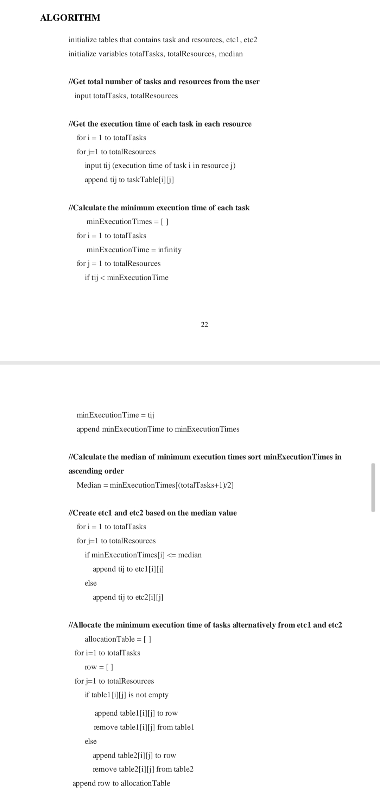
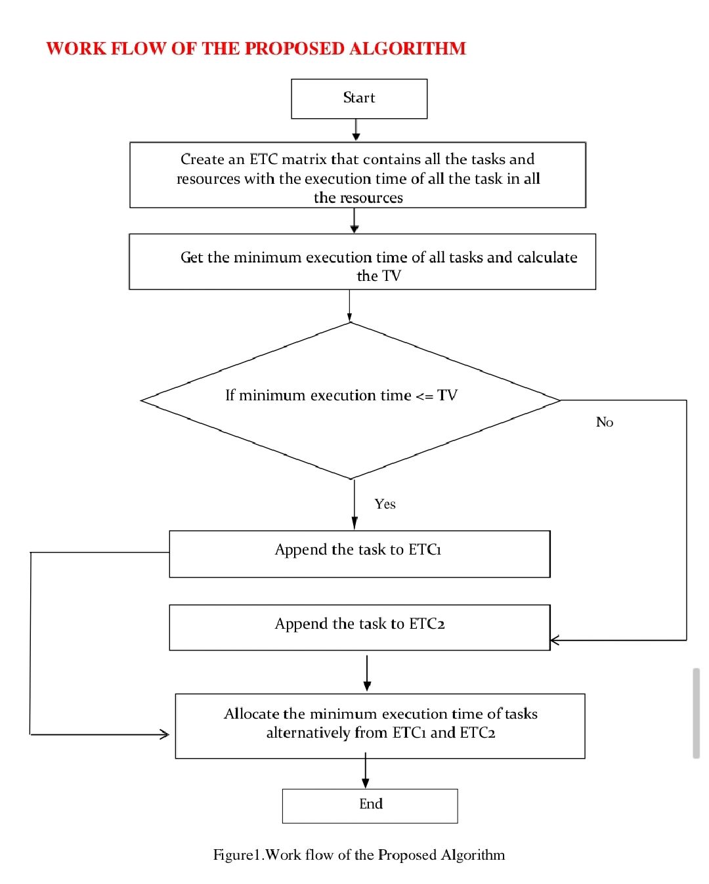
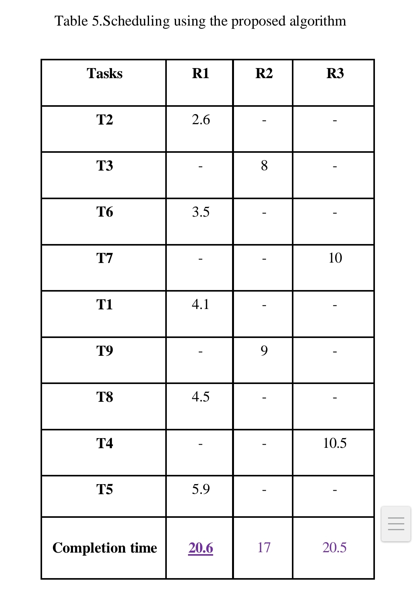
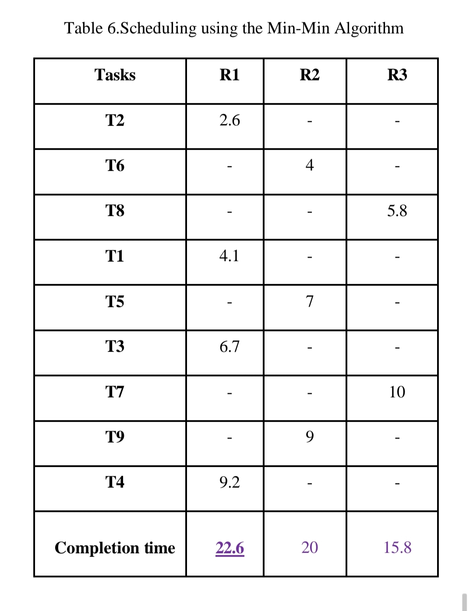
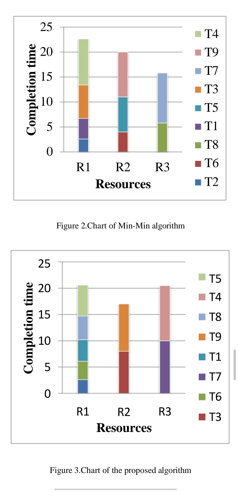

# An Efficient Task Scheduling Algorithm in Cloud Environment

## 📊 Overview
• Developed a cloud task scheduling algorithm to optimize resource utilization and reduce execution time   
• Used ETC matrices and threshold-based task segregation for efficient scheduling  
• Achieved improved makespan and load balancing compared to the Min-Min algorithm

## 🚀 Problem Statement
The traditional Min-Min algorithm prioritizes shorter tasks, which leads to load imbalance and inefficient utilization of resources.

## 💡 Proposed Solution
- Introduced a threshold-based scheduling algorithm  
- Used ETC (Expected Time to Compute) matrix for task-resource mapping  
- Segregated tasks based on median threshold value  
- Ensured balanced allocation of both small and large tasks  

## ⚙ Methodology
- Calculated completion time using ETC and resource availability  
- Derived threshold value using median execution time  
- Divided tasks into two groups (ETC1 & ETC2)  
- Allocated tasks alternately to improve load balancing  

---

## 🧠 Algorithm Design

---

## 🔄 Workflow of Proposed System

---

## 📊 Comparison (Existing vs Proposed)

---

## 📈 Performance Analysis

---

## 📈 Results & Improvements
- Reduced makespan  
- Improved load balancing  
- Better resource utilization  
- Reduced waiting time  

## 📄 Documentation
[View Full Project PDF](Task_Scheduling_Documentation.pdf)

## 🛠 Tools & Concepts
Cloud Computing • Task Scheduling • ETC Matrix • Load Balancing • Algorithm Design • Python Programming
